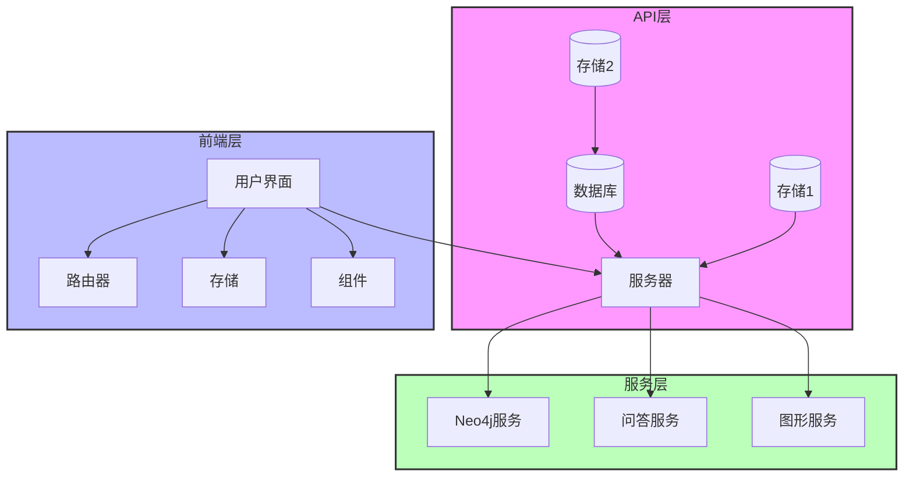

# 项目架构图

## 架构说明

1. **API层**

   - 数据库：负责数据持久化
   - 存储服务：提供文件存储功能
   - 服务器：处理API请求

2. **前端层**

   - 用户界面：Vue组件和视图
   - 路由器：Vue Router路由管理
   - 存储：Pinia状态管理
   - 组件：可复用的Vue组件

3. **服务层**
   - Neo4j服务：图数据库交互
   - 问答服务：处理QA相关功能
   - 图形服务：知识图谱管理
